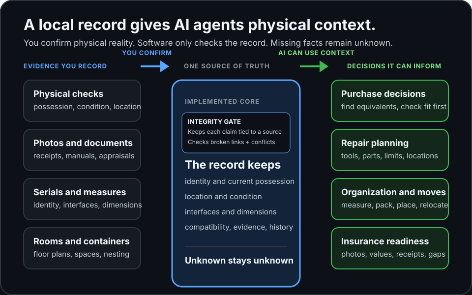

# agent-property-inventory

[](https://github.com/Anneo22/agent-property-inventory/actions/workflows/checks.yml)

`agent-property-inventory` gives local AI agents a reliable record of what you physically own, where it is, and what it works with.

Agents query it before buying, repairing, moving, organizing, or preparing an insurance record.

I built it as a bridge between agents and a person's physical world. The program stays small: structured local data, a CLI and an MCP server, with the agent doing the hard work.


## What one record unlocks



Each item keeps identity, possession, location, condition, interfaces, dimensions, history, and evidence together. No match means "not recorded," never "does not exist."

Today it supports physical checks, lifecycle history, compatibility, task kits, torque limits, spaces, packing, maintenance, insurance readiness, floor plans, and reviewed photo proposals. It has no recognition model, app, hosted sync, or insurer integration.

## Why agents can trust it

- **Evidence has a type.** A receipt proves a purchase. Possession needs a current check. Compatibility needs matching standards, sizes, and directions.
- **Unknowns survive.** Missing serials, locations, measurements, and items stay unknown.
- **One guarded path writes.** A change is locked, backed up, rebuilt, verified, and checked for broken links before it replaces the JSONL.

`Data/store/*.jsonl` is the source of truth. SQLite and `Inventory.md` are rebuilt views.

## Quick start

Python 3.11 or newer is required.

```bash
git clone https://github.com/Anneo22/agent-property-inventory.git
cd agent-property-inventory
python3 -m venv .venv
. .venv/bin/activate
python -m pip install -e '.[dev,mcp]'

demo_root="$(mktemp -d "${TMPDIR:-/tmp}/property-inventory-demo.XXXXXX")"
export PROPERTY_INVENTORY_ROOT="$demo_root/inventory"
export PROPERTY_INVENTORY_RUNTIME="$demo_root/runtime"
export PROPERTY_INVENTORY_MEDIA_ROOT="$demo_root/media"
export PROPERTY_INVENTORY_CATALOGUE_OUTPUT="$demo_root/notes/Inventory.md"

property-inventory init
property-inventory status
```

`status` rebuilds the views and runs every integrity check.

## Use it

```bash
property-inventory search "hex bit" --condition working --summary
property-inventory context --task "repair a bicycle tyre"
```

The CLI also records checks, orders, deliveries, moves, loans, sales, returns, evidence, maintenance, and offline proposals. Run `property-inventory --help` for every command.

## Connect an agent

The MCP server exposes inventory queries as local tools an agent can call over stdio.

```json
{
  "command": "/absolute/path/to/property-inventory-mcp",
  "args": [
    "--config", "/absolute/path/to/config.json",
    "--instance", "private",
    "--scope", "personal",
    "--profile", "read"
  ]
}
```

The instance selects an inventory, the scope filters visible data, and the profile controls tools. Read mode cannot write; private tools prepare proposals for reviewed CLI application. See [MCP profiles](docs/mcp.md).

## Documentation

[Architecture](docs/architecture.md) · [Schema](docs/schema.md) · [Operations](docs/operations.md) · [MCP](docs/mcp.md) · [Capture](docs/capture-adapter-protocol.md) · [Threat model](docs/threat-model.md)

## License

MIT. See [LICENSE](LICENSE).
